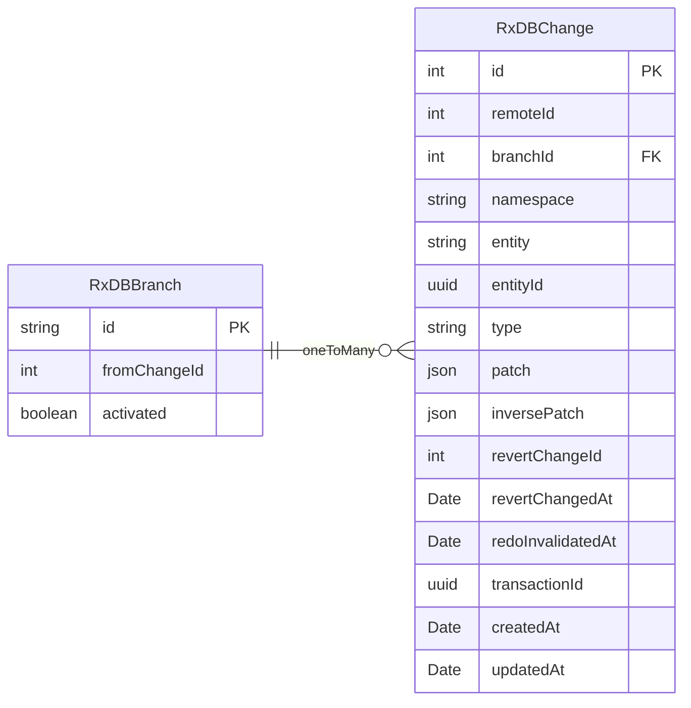

# 分支管理

RxDB 提供类似 Git 的分支管理能力，让你可以在本地创建多个数据分支，安全地进行实验性修改，然后选择性地合并或切换分支。

## 快速开始

```typescript
import { RxDB, SyncType } from '@aiao/rxdb';

const rxdb = new RxDB({
  dbName: 'myApp',
  entities: [Todo],
  sync: { local: { adapter: 'wa-sqlite' }, type: SyncType.None }
});

// 创建分支
await rxdb.versionManager.createBranch('feature-1');

// 切换分支
await rxdb.versionManager.switchBranch('feature-1');

// 删除分支
await rxdb.versionManager.removeBranch('feature-1');
```

## 分支管理 API

### 创建分支

```typescript
// 从当前状态创建分支
await rxdb.versionManager.createBranch('feature-1');

// 从指定 changeId 创建分支
await rxdb.versionManager.createBranch('feature-2', 12345);
```

### 切换分支

```typescript
await rxdb.versionManager.switchBranch('feature-1');
await rxdb.versionManager.switchBranch('main');
```

### 删除分支

```typescript
await rxdb.versionManager.removeBranch('feature-1');
```

:::warning
删除分支会同时删除该分支的所有变更历史。
:::

### 获取当前分支

```typescript
import { RxDBBranch } from '@aiao/rxdb';

const currentBranch = await RxDBBranch.findOne({
  where: {
    combinator: 'and',
    rules: [{ field: 'activated', operator: '=', value: true }]
  }
});
```

## 使用场景

### 测试新功能

```typescript
await rxdb.versionManager.createBranch('test-feature');
await rxdb.versionManager.switchBranch('test-feature');

const todo = new Todo();
todo.title = '测试任务';
await todo.save();

// 测试完成，切换回主分支
await rxdb.versionManager.switchBranch('main');
await rxdb.versionManager.removeBranch('test-feature');
```

### 离线编辑

```typescript
await rxdb.versionManager.createBranch('offline-work');
await rxdb.versionManager.switchBranch('offline-work');

// 离线修改...

// 恢复网络后切换回主分支
await rxdb.versionManager.switchBranch('main');
```

## 系统表结构

系统表 `RxDBChange` 会通过**数据库触发器（Trigger）** 记录所有数据库的数据变化（插入，修改，删除），`RxDBBranch` 表会记录当前分支，这样我们就可以通过历史记录来计算出任何时刻的数据，再去修改其他表的数据达到切换版本的需求。



### 关键字段

**RxDBBranch**

- `id`: 分支标识符
- `fromChangeId`: 分支起始点
- `activated`: 是否为当前分支

**RxDBChange**

- `id`: 变更序号（自增）
- `remoteId`: 远程变更ID
- `branchId`: 所属分支
- `type`: `insert` | `update` | `delete`
- `patch`: 正向变更（JSON Patch）
- `inversePatch`: 逆向变更（用于回滚）
- `revertChangeId`: 撤销时的变更ID
- `redoInvalidatedAt`: redo 失效时间

## 分支合并（规划中）

```typescript
// 合并分支
// await rxdb.versionManager.merge('feature-1', 'main');
```

## 相关文档

- [同步策略](./sync.md) - 了解数据同步配置
- [Undo/Redo](./undo-redo.md) - 撤销和重做功能
