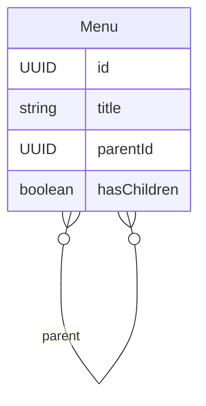

# 树结构 (Tree)

当前核心包里的树结构基于邻接表模型：每个节点只有一个可空 `parentId`，父子关系靠自引用维护。

## 区分两个角色

- `@TreeEntity()`：仅负责将仓库类型默认设为 `TreeRepository`，并补充树特性元数据
- `TreeAdjacencyListEntityBase`：真正提供 `parentId`、`parent$`、`children$`、`hasChildren` 和树查询静态方法

最常见且最稳妥的写法如下：

```ts
import { PropertyType, TreeAdjacencyListEntityBase, TreeEntity } from '@aiao/rxdb';

@TreeEntity({
  name: 'Menu',
  tableName: 'menu',
  properties: [{ name: 'title', type: PropertyType.string }]
})
export class Menu extends TreeAdjacencyListEntityBase {}
```

## 基类自动带来的内容

`TreeAdjacencyListEntityBase` 已经内置：

- 计算属性 `hasChildren`
- `children`：`ONE_TO_MANY`
- `parent`：`MANY_TO_ONE`
- `parentId`
- 树查询静态方法

其中 `parent` 关系是可空的，并且显式设置了：

```ts
onDelete: OnDeleteAction.CASCADE;
```

这意味着树结构默认就是“删父带子”。



## 关系访问

```ts
import { firstValueFrom } from 'rxjs';

const root = new Menu({ title: '根节点' });
const child = new Menu({ title: '子节点' });

child.parent$.set(root);
await child.save();

const parent = await firstValueFrom(child.parent$);
const children = await firstValueFrom(root.children$);
const count = await firstValueFrom(root.children$.count$);
```

你也可以直接改外键：

```ts
child.parentId = root.id;
await child.save();
```

## 树查询 API

树实体的静态方法返回 `Observable`：

```ts
import { firstValueFrom } from 'rxjs';

const descendants = await firstValueFrom(
  Menu.findDescendants({
    entityId: root.id,
    level: 2
  })
);

const ancestors = await firstValueFrom(
  Menu.findAncestors({
    entityId: child.id,
    level: 3
  })
);

const descendantCount = await firstValueFrom(
  Menu.countDescendants({
    entityId: root.id,
    level: 2
  })
);
```

### `FindTreeOptions` 的真实含义

- `entityId?: string | null`
- `where?`: 普通查询条件
- `level?: number`

当前实现的 `level` 规则：

- 默认 `0`
- 小于 `0` 会被归一化为 `0`
- 大于 `100` 会被限制为 `100`

### 返回语义

- `findDescendants`：指定 `entityId` 时，返回“当前节点 + 后代节点”
- `countDescendants`：指定 `entityId` 时，不包含当前节点，只统计后代数量
- `findAncestors`：指定 `entityId` 时，返回“当前节点 + 祖先节点”
- `countAncestors`：指定 `entityId` 时，不包含当前节点，只统计祖先数量

### 根节点查询

`entityId` 不传时，树查询以根节点集合为起点；框架内部会把 `entityId` 归一化为 `null`。

## 构建一棵简单树

```ts
const root = new Menu({ title: '根' });
await root.save();

const a = new Menu({ title: 'A' });
a.parent$.set(root);
await a.save();

const b = new Menu({ title: 'B' });
b.parentId = root.id;
await b.save();
```

## 建议

- 想要完整树能力，优先继承 `TreeAdjacencyListEntityBase`
- `@TreeEntity()` 本身不生成父子关系，不要误认为单独使用它就会自动出现 `parentId`
- 祖先/后代查询用静态方法，普通列表过滤仍然走常规 `find`
