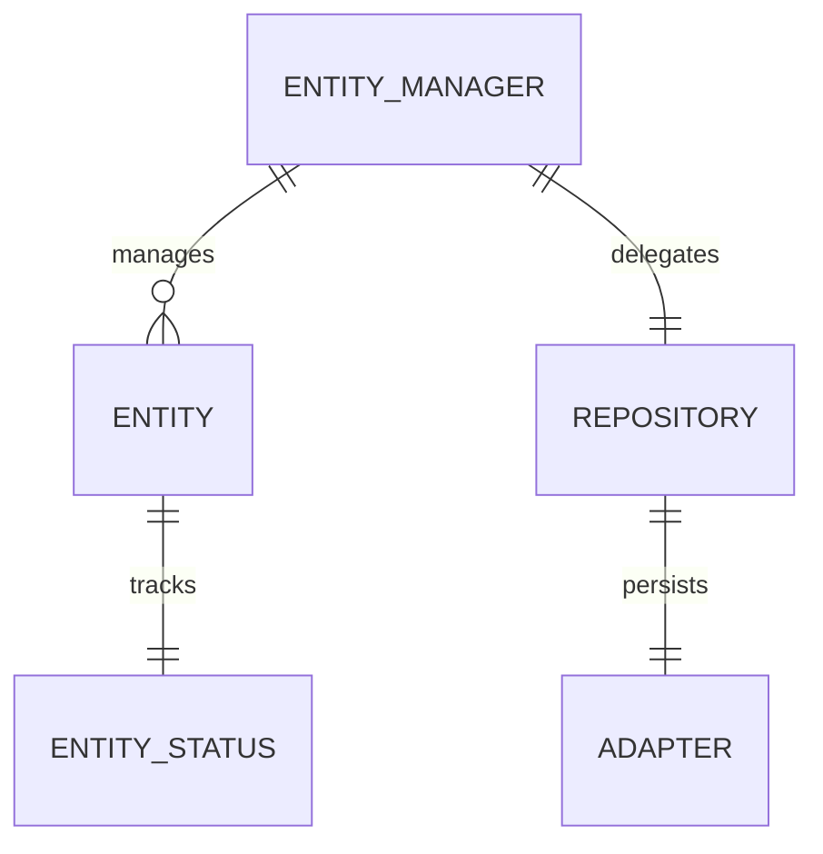
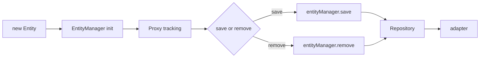

# 模型修改

模型修改就是把数据写回本地数据库。业务代码真正常用的入口不多,先记住:

- 单条实体:`save()`、`remove()`、`reset()`
- 批量实体:`rxdb.entityManager.saveMany()`、`rxdb.entityManager.removeMany()`
- 更底层写入:`rxdb.entityManager.create()`、`update()`、`remove()`

## 推荐入口

| 场景           | 推荐 API                          | 说明                                     |
| -------------- | --------------------------------- | ---------------------------------------- |
| 新建一条       | `new Entity()` + `entity.save()`  | 默认主路径                               |
| 更新一条       | 改属性后 `entity.save()`          | 按 `status.local` 自动走 create / update |
| 删除一条       | `entity.remove()`                 | 拿到实体实例时最直接                     |
| 批量创建或更新 | `rxdb.entityManager.saveMany()`   | 统一合成 mutation                        |
| 批量删除       | `rxdb.entityManager.removeMany()` | 避免逐条循环删除                         |

## 写入关系图



## 单条写入流程



## 状态判断

```ts
import { getEntityStatus } from '@aiao/rxdb';

const status = getEntityStatus(todo);

console.log(status.local);
console.log(status.modified);
```

- `local === false` — 实体还没写入本地库
- `local === true` — 实体已经存在于本地库
- `modified === true` — 当前有未保存的改动

## 关于事务

业务写入的稳定公开入口仍是 `save()` / `remove()` / `saveMany()` / `removeMany()`。不要把某个公开的 `rxdb.transaction(...)` 当主入口。

需要更底层的事务边界时就已经进到 adapter 层——见 [事务机制](./transaction.md)。

## 继续阅读

- [创建数据](./create.md)
- [更新数据](./update.md)
- [删除数据](./delete.md)
- [事务机制](./transaction.md)
