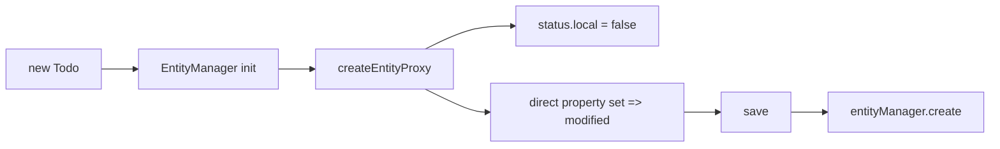

# 创建数据

创建一条记录，最稳妥的写法就是先 `new`，再 `save()`。

## 最常见写法

```ts
const todo = new Todo({
  title: '完成文档',
  completed: false
});

await todo.save();
```

`save()` 最终会进入 `entityManager.save()`，然后根据实体状态决定走创建还是更新。

## 创建判定逻辑

```ts
const status = getEntityStatus(todo);

if (status.local) {
  await rxdb.entityManager.update(todo);
} else {
  await rxdb.entityManager.create(todo);
}
```

对于新实体，关键不是某个静态 `create()`，而是：

- 这条实体是否已经存在于本地库
- `status.local` 当前是不是 `false`

## Proxy 接入机制

实体在初始化阶段被 `createEntityProxy()` 包装。字段直接赋值时会触发状态跟踪。



## 直接创建

如果你在服务层已经明确知道这是新记录，也可以直接写：

```ts
const todo = new Todo({ title: '任务 1' });

await rxdb.entityManager.create(todo);
```

普通业务代码还是优先 `save()`，因为它更不容易写错分支。

## 批量创建

```ts
const todos = [new Todo({ title: '任务一' }), new Todo({ title: '任务二' }), new Todo({ title: '任务三' })];

await rxdb.entityManager.saveMany(todos);
```

`saveMany()` 会把一批待创建实体合成一次 mutations，而不是逐条 `save()`。

## 创建前后状态

```ts
import { getEntityStatus } from '@aiao/rxdb';

const todo = new Todo({ title: '任务' });

console.log(getEntityStatus(todo).local); // false

await todo.save();

const status = getEntityStatus(todo);
console.log(status.local); // true
console.log(status.modified); // false
```

## 建议

- 单条创建优先 `new Entity()` + `save()`
- 批量创建优先 `saveMany()`
- 不要继续把 `Todo.create()` 这类旧写法当主文档入口
