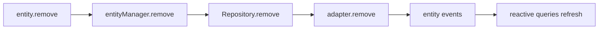

# 删除数据

删除的主路径和创建、更新一致，优先走实体实例方法。

## 单条删除

```ts
import { firstValueFrom } from 'rxjs';

const todo = await firstValueFrom(
  Todo.findOneOrFail({
    where: {
      combinator: 'and',
      rules: [{ field: 'id', operator: '=', value: todoId }]
    }
  })
);

await todo.remove();
```

`remove()` 最终会转到 `entityManager.remove(this)`，再下沉到 `Repository.remove()` 和 adapter。

## 批量删除

```ts
const completedTodos = await firstValueFrom(
  Todo.findAll({
    where: {
      combinator: 'and',
      rules: [{ field: 'completed', operator: '=', value: true }]
    }
  })
);

await rxdb.entityManager.removeMany(completedTodos);
```

## 删除流程



## 删除后的状态

删除后，这条实体不再代表本地库里的有效记录。当前实现里最重要的变化是：

- `status.local = false`
- `status.removed = true`

## 建议

- 单条删除用 `entity.remove()`
- 批量删除用 `removeMany()`
- 避免使用 `Todo.remove(todo)` 等旧式静态入口
