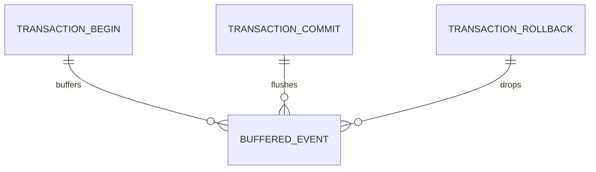
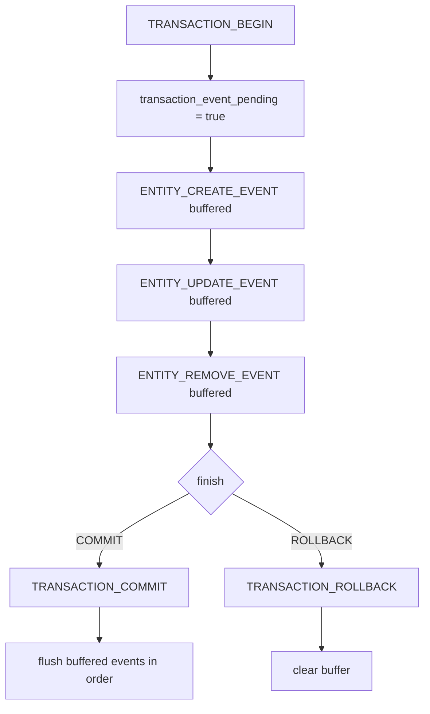

# 事务

这篇讲的是当前实现里的事务事件机制，不是鼓励你在业务层直接依赖某个公开 `rxdb.transaction(...)` API。

## 结论

- 事务主要由 adapter 层负责
- RxDB 核心层额外做了一层事件缓冲
- 事务期间，非事务事件会先进入缓冲队列
- `COMMIT` 后再按原顺序统一派发
- `ROLLBACK` 后直接丢弃缓冲事件

## 事务事件关系图



## 事件时序



## 当前核心逻辑

`RxDB.dispatchEvent()` 的判断是：

```ts
if (this.#transaction_event_pending && isTransactionEvent(event) === false) {
  this.#need_dispatch_events.push(event);
} else {
  listeners.forEach(listener => listener.call(this, event));
}
```

配合 `#init_event()` 里的监听器，结果就是：

1. `TRANSACTION_BEGIN` 立即派发，并把 `transaction_event_pending` 置为 `true`
2. 事务期间的普通实体事件先进入 `#need_dispatch_events`
3. `TRANSACTION_COMMIT` 立即派发，然后顺序重放缓冲事件
4. `TRANSACTION_ROLLBACK` 立即派发，然后清空缓冲，不做重放

## 为什么这么设计

如果事务中的 CREATE / UPDATE / REMOVE 事件立刻通知 UI，界面会看到中间态。

这层缓冲的意义很直接：

- 提交前不暴露半成品状态
- 回滚时不用再补一轮“撤销通知”
- 查询订阅尽量只看到最终结果

## 业务层怎么写

日常业务代码仍然优先使用：

- `save()`
- `remove()`
- `saveMany()`
- `removeMany()`

如需控制 adapter 级事务，属于更底层的能力，不应在基础业务文档中将其作为常规主入口。

## 事务执行器（C2 契约）

适配器 `transaction()` / `runInTransaction()` 的回调现在收到 `TransactionExecutor`，不再是裸 client：

```typescript
import type { TransactionExecutor } from '@aiao/rxdb';

await adapter.transaction(async (executor: TransactionExecutor) => {
  const repo = executor.getRepository(Todo);
  await repo.create({ title: 'inside tx' });

  // 嵌套内层工作 —— 复用当前 executor
  await executor.run(async inner => inner.getRepository(Todo).count());

  // 合并远端变更到本事务
  await executor.mergeChanges(actions, localChanges, /* disableTriggers */ false);
});
```

**为什么必须用 executor**：直接 `entity.save()` 走的是适配器队列，而队列唯一的并发槽位正被本次事务占着，于是永久挂起（C2 设计见 `code-reviews/transaction-executor-design.md` 裁决④）。

零参回调（`async () => {}`）仍然兼容 —— TypeScript 允许形参更少。
