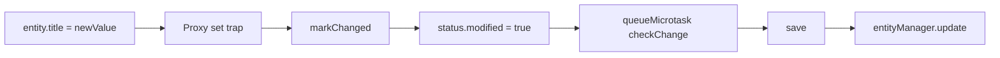

# 更新数据

更新数据的主路径就是改属性，然后 `save()`。

## 最常见写法

```ts
import { firstValueFrom } from 'rxjs';

const todo = await firstValueFrom(
  Todo.findOneOrFail({
    where: {
      combinator: 'and',
      rules: [{ field: 'id', operator: '=', value: todoId }]
    }
  })
);

todo.title = '更新后的标题';
todo.completed = true;

await todo.save();
```

## 为什么它知道该更新

实体被 Proxy 包装后，直接属性赋值会：

- 调用 `markChanged()` 记录变更字段
- 立刻把 `status.modified` 设为 `true`
- 通过 `queueMicrotask()` 延后执行 patch 检查



## 边界情况

当前 Proxy 仅跟踪直接字段赋值，不自动跟踪深层对象内部变更。

例如下面这种写法不可靠：

```ts
todo.meta.priority = 'high';
```

更稳妥的是整段重赋值：

```ts
todo.meta = {
  ...todo.meta,
  priority: 'high'
};
```

## 无变更时的行为

`entityManager.update()` 会先检查 `status.modified`。若无变更，直接返回原实体，不执行无意义写入。

```ts
const status = getEntityStatus(todo);

if (status.modified) {
  await rxdb.entityManager.update(todo);
}
```

## 撤销未保存修改

```ts
todo.title = '临时修改';

await todo.reset();
```

`reset()` 会把实体恢复到最近一次快照的 `origin` 状态，清掉 `modified` 标记、patch 缓存和变更历史。

## 批量更新

```ts
const todos = await firstValueFrom(
  Todo.findAll({
    where: {
      combinator: 'and',
      rules: [{ field: 'completed', operator: '=', value: false }]
    }
  })
);

todos.forEach(todo => {
  todo.completed = true;
});

await rxdb.entityManager.saveMany(todos);
```

## 建议

- 已经拿到实体实例时，优先“改属性 + `save()`”
- 深层对象字段改动尽量用整段重赋值
- 批量改动用 `saveMany()`
- 避免使用 `Todo.update(...)` 等旧式入口
