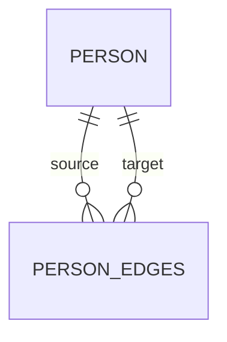

# countNeighbors

`countNeighbors` 统计图结构中邻居节点的数量。文档这里讨论的是实体静态方法，所以返回的是 `Observable<number>`。

## 图关系图



## 统计语义

- 不包含起始节点本身
- 方向、层级、过滤规则与 [findNeighbors](./findNeighbors.md) 保持一致
- 适合只关心数量，不关心具体节点内容的场景

## 基础用法

```ts
import { firstValueFrom } from 'rxjs';

const count = await firstValueFrom(
  Person.countNeighbors({
    entityId: alice.id,
    direction: 'both',
    level: 2
  })
);
```

## 带过滤的统计

```ts
const count = await firstValueFrom(
  Person.countNeighbors({
    entityId: alice.id,
    level: 1,
    edgeWhere: {
      weight: { min: 5 }
    }
  })
);
```

## 什么时候优先用它

- 显示粉丝数、关注数、连接数
- 做阈值判断
- 你不需要返回整组节点对象

## 参考

- [findNeighbors](./findNeighbors.md)
- [findPaths](./findPaths.md)
