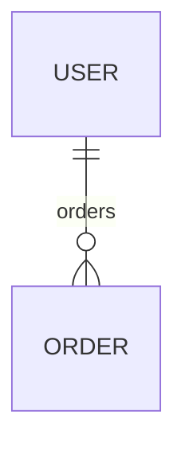

# EXISTS / NOT EXISTS

`exists` 和 `notExists` 用来判断关系字段里是否存在满足条件的关联实体。

## 关系图



## 基础写法

```ts
const usersWithOrders = await firstValueFrom(
  User.find({
    where: {
      combinator: 'and',
      rules: [{ field: 'orders', operator: 'exists' }]
    }
  })
);
```

```ts
const usersWithoutOrders = await firstValueFrom(
  User.find({
    where: {
      combinator: 'and',
      rules: [{ field: 'orders', operator: 'notExists' }]
    }
  })
);
```

## 带子查询条件

子查询条件写在 `where` 字段里，不要写到 `value`。

```ts
const usersWithCompletedOrders = await firstValueFrom(
  User.find({
    where: {
      combinator: 'and',
      rules: [
        {
          field: 'orders',
          operator: 'exists',
          where: {
            combinator: 'and',
            rules: [{ field: 'status', operator: '=', value: 'completed' }]
          }
        }
      ]
    }
  })
);
```

## 适用关系

- `ONE_TO_ONE`
- `ONE_TO_MANY`
- `MANY_TO_ONE`
- `MANY_TO_MANY`

## 什么时候优先用它

- 只需要判断关联是否存在
- 不想先加载关系再在内存里过滤
- 想让过滤逻辑直接下沉到查询层

## 参考

- [查询操作符](./operators.md)
- [find](./find.md)
