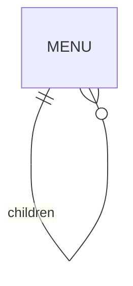

# findAncestors

`findAncestors` 用于树结构实体的祖先查询。它返回的是响应式 `Observable`。

## 树关系图



## 签名

```ts
findAncestors(options: FindTreeOptions<T>): Observable<InstanceType<T>[]>
```

## level 语义

- `level` 默认 `0`
- `level < 0` 会被规范化为 `0`
- `level > 100` 会被限制为 `100`
- 层级数包含当前节点本身

## 返回语义

传 `entityId` 时，返回“当前节点 + 祖先节点”。

此 API 通常应显式传入 `entityId`。

## 基础用法

```ts
import { firstValueFrom } from 'rxjs';

const ancestors = await firstValueFrom(
  Menu.findAncestors({
    entityId: leaf.id,
    level: 3
  })
);
```

## 面包屑场景

```ts
const ancestors = await firstValueFrom(Menu.findAncestors({ entityId: leaf.id }));

const breadcrumb = ancestors.slice().reverse();
```

## 顺序说明

不要假设数据库天然返回”从根到叶”的顺序。如 UI 依赖顺序，应在业务层显式处理，如 `reverse()`。

## 参考

- [countAncestors](./countAncestors.md)
- [findDescendants](./findDescendants.md)
