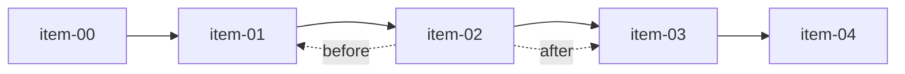

# findByCursor

`findByCursor` 适合无限滚动和稳定翻页。它不是基于 `offset`，而是基于一条实体本身做游标定位。

## 签名

```ts
findByCursor(options: FindByCursorOptions<T>): Observable<InstanceType<T>[]>
```

```ts
interface FindByCursorOptions<T> {
  where: RuleGroup<InstanceType<T>>;
  orderBy: OrderBy[];
  before?: InstanceType<T>;
  after?: InstanceType<T>;
  limit?: number;
}
```

当前默认值：

- `limit` 默认 `100`

## 游标定位



- `after: cursor`：返回排在游标之后的记录，不包含游标本身
- `before: cursor`：返回排在游标之前的记录，不包含游标本身

## 基础用法

```ts
import { firstValueFrom } from 'rxjs';

const firstPage = await firstValueFrom(
  Todo.findByCursor({
    where: { combinator: 'and', rules: [] },
    orderBy: [
      { field: 'createdAt', sort: 'desc' },
      { field: 'id', sort: 'asc' }
    ],
    limit: 20
  })
);

const nextPage = await firstValueFrom(
  Todo.findByCursor({
    where: { combinator: 'and', rules: [] },
    orderBy: [
      { field: 'createdAt', sort: 'desc' },
      { field: 'id', sort: 'asc' }
    ],
    after: firstPage[firstPage.length - 1],
    limit: 20
  })
);
```

## 三条硬约束

这些不是“建议”，而是仓库层会直接抛错：

1. `orderBy` 不能为空
2. `orderBy` 最后一个字段必须是 `id`
3. `before` 和 `after` 不能同时传

正确的排序写法通常是：

```ts
orderBy: [
  { field: 'createdAt', sort: 'desc' },
  { field: 'id', sort: 'asc' }
];
```

## 为什么最后必须是 `id`

游标分页需要稳定且唯一的排序尾键。否则多条记录在前面字段相同时，页边界会漂移，结果会重复或漏项。

## 和 `find` 的区别

| 方法           | 更适合             |
| -------------- | ------------------ |
| `find`         | 传统页码分页       |
| `findByCursor` | 无限滚动、稳定翻页 |

## 注意事项

`findByCursor` 的响应式结果会持续跟随查询更新。首次查询使用 `limit: 20`，后续增量合并时结果集不一定永远机械地保持”正好 20 条”。

## 参考

- [find](./find.md)
- [findAll](./findAll.md)
