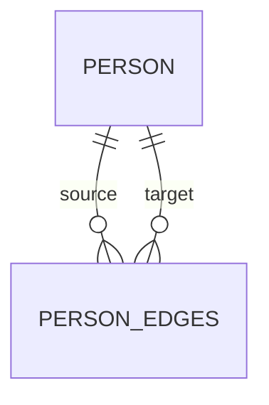

# findNeighbors

`findNeighbors` 用于图结构的邻居查询。文档这里讨论的是实体静态方法，所以返回值是 `Observable`。

如果你直接拿 `GraphRepository` 实例调用同名方法，底层返回的是 `Promise`。

## 图关系图



## 签名

```ts
findNeighbors(options: FindNeighborsOptions<T>): Observable<NeighborResult<T>[]>
```

## 查询选项

| 选项        | 说明                                     |
| ----------- | ---------------------------------------- |
| `entityId`  | 起始节点 ID，必填                        |
| `direction` | `'in' \| 'out' \| 'both'`，默认 `'both'` |
| `level`     | 最大跳数，默认 `1`                       |
| `where`     | 节点过滤条件                             |
| `edgeWhere` | 边过滤条件                               |

## level 归一化

- 默认 `1`
- 小于 `1` 会被规范化为 `1`
- 大于 `100` 会被限制为 `100`

## 返回语义

- 结果不包含起始节点本身
- 结果里每一项都包含 `node`、`edge`、`level`
- 同一节点通过多条路径可达时，会按较短路径收敛结果

## 基础用法

```ts
import { firstValueFrom } from 'rxjs';

const neighbors = await firstValueFrom(
  Person.findNeighbors({
    entityId: alice.id,
    direction: 'out',
    level: 2
  })
);
```

## 权重和属性过滤

```ts
const importantNeighbors = await firstValueFrom(
  Person.findNeighbors({
    entityId: alice.id,
    level: 1,
    edgeWhere: {
      weight: { min: 5 },
      properties: { category: 'friend' }
    }
  })
);
```

## 参考

- [countNeighbors](./countNeighbors.md)
- [findPaths](./findPaths.md)
- [图结构定义](../plugins/rxdb-plugin-graph/graph-entity.md)
