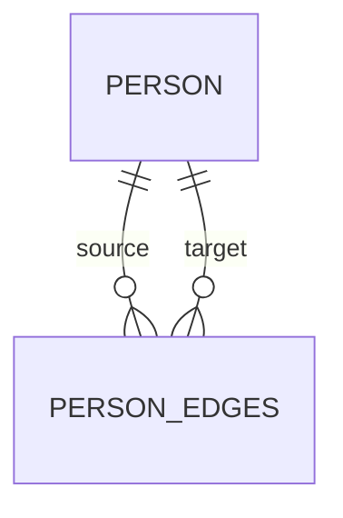

# findPaths

`findPaths` 用于图结构中的路径搜索。文档这里讨论的是实体静态方法，所以返回的是 `Observable<GraphPath<T>[]>`。

## 图关系图



## 签名

```ts
findPaths(options: FindPathsOptions<T>): Observable<GraphPath<T>[]>
```

## 查询选项

| 选项        | 说明                                     |
| ----------- | ---------------------------------------- |
| `fromId`    | 源节点 ID，必填                          |
| `toId`      | 目标节点 ID，必填                        |
| `direction` | `'in' \| 'out' \| 'both'`，默认 `'both'` |
| `maxDepth`  | 最大搜索深度，默认 `10`                  |
| `where`     | 路径中节点过滤条件                       |
| `edgeWhere` | 路径中边过滤条件                         |

## maxDepth 归一化

- 默认 `10`
- 小于 `1` 会被规范化为 `1`
- 大于 `100` 会被限制为 `100`

## 返回语义

- 返回所有非循环路径
- 每条路径包含 `nodes`、`edges`、`length`、`totalWeight?`
- 结果优先按路径长度排序；长度相同再看总权重

## 基础用法

```ts
import { firstValueFrom } from 'rxjs';

const paths = await firstValueFrom(
  Person.findPaths({
    fromId: alice.id,
    toId: bob.id,
    direction: 'out',
    maxDepth: 5
  })
);
```

## 边过滤

```ts
const paths = await firstValueFrom(
  Person.findPaths({
    fromId: alice.id,
    toId: bob.id,
    edgeWhere: {
      weight: { max: 10 },
      properties: { category: 'road' }
    }
  })
);
```

## 参考

- [findNeighbors](./findNeighbors.md)
- [countNeighbors](./countNeighbors.md)
